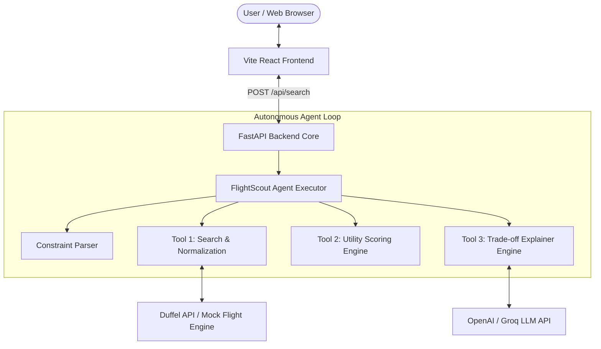

# FlightScout System Architecture 🏗️

FlightScout is designed as an agent-driven flight discovery and decision-support engine. It bridges raw API aggregators (Duffel API) with multi-criteria optimization algorithms and autonomous LLM agent tooling.

## High-Level Architecture Diagram

## Key Architectural Decisions

1. **Deterministic Utility Scoring Core**: Instead of asking LLMs to calculate numbers (which causes hallucinations and inconsistency), FlightScout uses a deterministic mathematical function in python (`scoring.py`) to grade price competitiveness, duration efficiency, layover convenience, and schedule timing.
2. **Autonomous Tool Decomposition**: The search orchestrator executes tools sequentially in a pipeline:
   - **Step 1 (Parser)**: Converts unstructured text like *"cheap morning flight, no stops"* into preference vectors.
   - **Step 2 (Search Tool)**: Fetches raw carrier payloads and standardizes them into `FlightOffer` objects.
   - **Step 3 (Scoring Tool)**: Applies user dynamic weights ($W_{price}, W_{speed}, W_{comfort}$) to generate normalized composite scores.
   - **Step 4 (Explainer Tool)**: Generates human-friendly explanations of trade-offs comparing each flight to the optimal boundary limits.
3. **Graceful Fallbacks**: If external API keys (Duffel or OpenAI/Groq) are absent, the application dynamically switches to high-fidelity synthetic generators without breaking the user flow.
